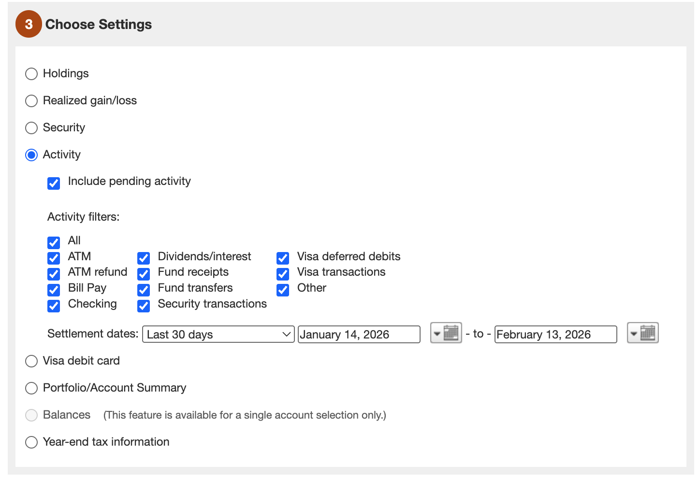

# How to Export from Merrill Lynch

This guide walks through exporting from Merrill Lynch (Merrill Edge) for import into myInvestments via **Setup → Import From Broker**.

**For Merrill you need both exports:** first **Holdings**, then **Activity**. Import them in that order so positions come from Holdings and activity history is synced.

---

## Step 1: Open Export

1. Log in to [Merrill Edge](https://www.merrilledge.com) (or Merrill Lynch).
2. Go to **Accounts** or **Account Management** and find the **Download** or **Export** option (often under **History**, **Statements**, or **Documents**).
3. Start the export / download flow. You will typically see a multi-step wizard.

---

## Step 2: Export Both Data Types (required)

Run the Merrill export flow **twice**:

1. **Holdings** — Choose **Holdings** as the data type. This gives the current positions snapshot (stocks, options, cash). Download the CSV.
2. **Activity** — Run the export again and choose **Activity**. This gives transactions (trades, dividends, transfers) for the date range you set. Download the CSV.

Both files are required for a full Merrill sync in myInvestments.

---

## Step 3: Choose Settings (Activity)

When exporting **Activity**, use the **Choose Settings** step as follows:

1. **Data type:** Select **Activity** (radio button).
2. **Include pending activity:** Check this if you want pending transactions in the export.
3. **Activity filters:** Select the types you want. For a full sync into myInvestments, select **All** or ensure at least **Security transactions**, **Dividends/interest**, **Fund transfers**, and **Fund receipts** are included.
4. **Settlement dates:** Pick the date range (e.g. **Last 30 days** or a custom range from/to). Use a range that covers the history you want to import.

Then continue to the next step (e.g. format, account selection) and complete the export.

---

## Step 4: Export Format and Download

- Choose **CSV** (or **Excel** if you can save as CSV later).
- Select the account(s) to include.
- Download the file. For Activity, the file will contain columns such as date, symbol, type, quantity, price, etc. For Holdings, you’ll get account, symbol, quantity, cost basis, market value, etc.

---

## Step 5: Import into myInvestments

1. In myInvestments go to **Setup → Import From Broker**.
2. Ensure each Merrill account has a matching app account with **accountRef** set to the broker account number (e.g. `51X-98940`). Create accounts first if needed.
3. **Import Holdings first:** Choose broker (Merrill), export type **Holdings**, upload the Holdings CSV. Parse & preview, then Import.
4. **Import Activity:** Choose broker (Merrill), export type **Activities**, upload the Activity CSV. Parse & preview, then Import.

For CLI import using a config file (both files in one run), see **Broker import workflow** in [ghostbranch-feature.md](./ghostbranch-feature.md) and the `broker-import` script.

---

## Why both are required (Merrill)

| Export type | Role in myInvestments |
|-------------|------------------------|
| **Holdings** | Sets current positions (stocks, options, cash) per account from the CSV. Import first. |
| **Activity** | Imports transaction history (trades, dividends, transfers). Import after Holdings. |

For Merrill, use both: Holdings establishes positions; Activity keeps history in sync. Import order: **Holdings → Activity**.

---

## Troubleshooting

- **Account not matching:** In Setup → Import From Broker, ensure each Merrill account has a matching app account with **accountRef** set to the broker account number (e.g. `51X-98940`, `79Z-79494`). Create accounts first if needed (or import from [myaccounts.csv](../data/myaccounts.csv) and set `accountRef`).
- **Date range:** If you need more history, run the Merrill export again with a longer settlement date range and re-import (the app will skip already-imported activities).
- **CSV format:** The app expects Merrill’s standard export columns. If you use a custom or older format, the parser may need to be extended (see `apps/frontend/src/app/api/import/parse-broker` and format handlers).
