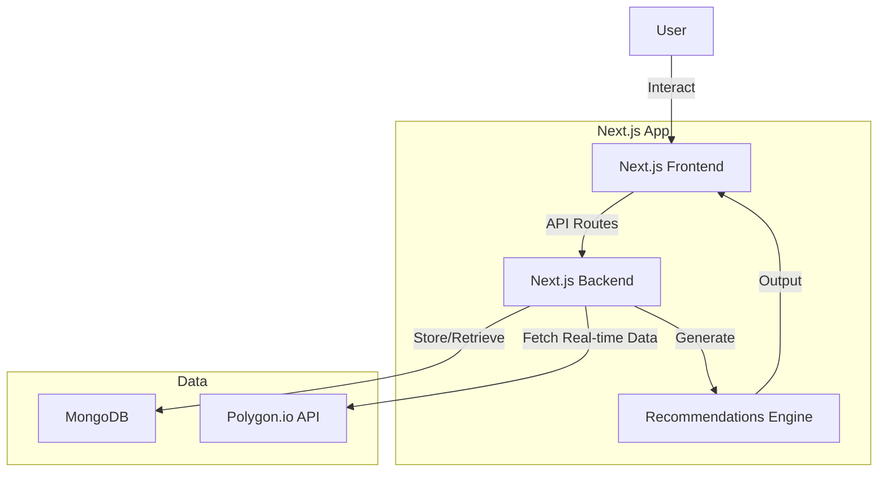

# myInvestments

## Overview
This application manages investment portfolios, tracking accounts, positions (stocks, options, cash), watch lists, and generating recommendations. It aggregates portfolio values, supports risk profiles and strategies per account, and integrates real-time data from Polygon.io. Built with Next.js, React, TypeScript, and MongoDB.

## Tech Stack
- **Frontend**: Next.js 16 (App Router), React 19, TypeScript
- **Styling**: Tailwind CSS v4
- **Database**: MongoDB
- **Market Data**: Polygon.io API

## Requirements

### Functional Requirements
- **Portfolio Management**: Define a portfolio that aggregates values from one or more accounts. Portfolio includes total value roll-up, performance metrics (e.g., ROI, unrealized gains/losses).
- **Account Management**: Each account has:
  - Unique ID, name, balance.
  - Risk level (e.g., low, medium, high).
  - Preferred investment strategy (e.g., growth, income, balanced; moderate/aggressive options aligned with user goals like Tesla-focused growth to 1M shares by 2030).
  - Zero or many positions.
  - Recommendations generated based on positions (e.g., buy/sell suggestions using current/mid/future earnings data for stocks like TSLA, NVDA).
- **Position Management**: Positions can be:
  - Stocks: Ticker, shares, purchase price, current value (fetched via Polygon).
  - Options: Contract details (strike, expiration, type: call/put), quantity, premium.
  - Cash: Amount, currency.
  - Each position links to a watch list item (optional: alerts for price thresholds).
- **Watch List**: Per position or account, track symbols with alerts (e.g., price changes, news).
- **Recommendations**: Algorithmic suggestions per account, factoring risk/strategy. Moderate: Bull call spreads on TSLA/NVDA. Aggressive: OTM calls on volatile stocks like IONQ.
- **Real-time Updates**: Fetch stock/option prices via Polygon API for live UI refreshes.
- **Data Persistence**: Store portfolios, accounts, positions in MongoDB.
- **UI Features**: Dashboard with views for portfolios, accounts, positions; real-time charts; input forms for adding/editing; recommendation panel.

### Non-Functional Requirements
- **Performance**: Real-time updates via WebSockets or polling (every 5-10s during market hours).
- **Security**: Environment variables for API keys. Next.js API routes for secure backend calls.
- **Scalability**: MongoDB handles datasets efficiently. Next.js supports edge deployment.
- **Deployment**: Local dev with `npm run dev`. Production via Vercel or Docker.

## Project Structure
```
src/
├── app/                    # Next.js App Router
│   ├── globals.css         # Tailwind styles
│   ├── layout.tsx          # Root layout
│   └── page.tsx            # Landing page
├── components/             # React components
│   ├── PortfolioCard.tsx   # Portfolio overview
│   └── MarketConditions.tsx # Market indices
├── lib/                    # Utilities
│   ├── mongodb.ts          # DB connection
│   └── mock-data.ts        # Sample data
└── types/                  # TypeScript types
    └── portfolio.ts        # Domain types
```

## High-Level Design

### Components
- **Frontend**: Next.js App Router with React Server Components and Client Components for interactivity.
- **API Layer**: Next.js API routes (`/api/*`) for backend logic, Polygon integration, and MongoDB operations.
- **Database**: MongoDB schemas:
  - Portfolio: {_id, name, accounts: [account_ids], total_value}.
  - Account: {_id, name, risk_level, strategy, positions: [position_ids], recommendations: []}.
  - Position: {_id, type (stock/option/cash), details (ticker/strike/etc.), watch_list: {symbol, alerts}}.
- **Integration**: Polygon API for real-time data (stocks, options chains). WebSocket or polling for updates.
- **Recommendation Engine**: Rule-based logic: For moderate risk, suggest spreads on TSLA; aggressive, OTM calls.

### Data Flow
1. User adds portfolio/account/position via UI.
2. API route saves to MongoDB.
3. UI requests updates; API fetches from Polygon, computes values/recommendations.
4. Display aggregated portfolio value, positions, suggestions.

## Architecture Diagram



## Getting Started

### Prerequisites
- Node.js 18+
- MongoDB (local or Atlas)
- Polygon.io API key

### Installation
```bash
npm install
```

### Environment Variables
Create `.env.local`:
```
MONGODB_URI=mongodb://localhost:27017
MONGODB_DB=myinvestments
POLYGON_API_KEY=your_api_key_here
CRON_SECRET=your_random_secret_here
```

### Development
```bash
npm run dev
```
Open http://localhost:3000

### Build
```bash
npm run build
npm start
```

## Scheduled Alert Analysis

The watchlist alert system analyzes your positions daily and generates HOLD/CLOSE/BTC recommendations. There are multiple ways to schedule this:

### Option 1: Vercel Cron (Recommended for Vercel deployments)
The `vercel.json` is pre-configured to run daily at 4:00 PM EST (market close):
```json
{
  "crons": [
    {
      "path": "/api/cron/daily-analysis",
      "schedule": "0 21 * * 1-5"
    }
  ]
}
```
Just deploy to Vercel and cron runs automatically (Pro plan required for cron).

### Option 2: GitHub Actions
A workflow is configured in `.github/workflows/daily-analysis.yml`. Set these repository secrets:
- `APP_URL`: Your deployed app URL (e.g., `https://myinvestments.vercel.app`)
- `CRON_SECRET`: Same value as your `CRON_SECRET` env variable

The workflow runs at 4:00 PM EST (21:00 UTC) Monday-Friday.

### Option 3: External Cron Service
Use any cron service (cron-job.org, EasyCron, etc.) to call:
```
GET https://your-app.com/api/cron/daily-analysis?secret=YOUR_CRON_SECRET
```
Or with Authorization header:
```
Authorization: Bearer YOUR_CRON_SECRET
```

### Option 4: Manual Trigger
Click "Run Analysis" button on the Watchlist page, or call the API directly.

### Configuring Alert Frequency
In the Watchlist → Alert Settings tab, you can configure:
- **Frequency**: Realtime, Daily, or Weekly
- **Delivery Channels**: Email, SMS, Slack, Push
- **Thresholds**: Profit %, Loss %, DTE warnings
- **Message Templates**: Concise, Detailed, Actionable, Risk-Aware

## Version
1.0.0
