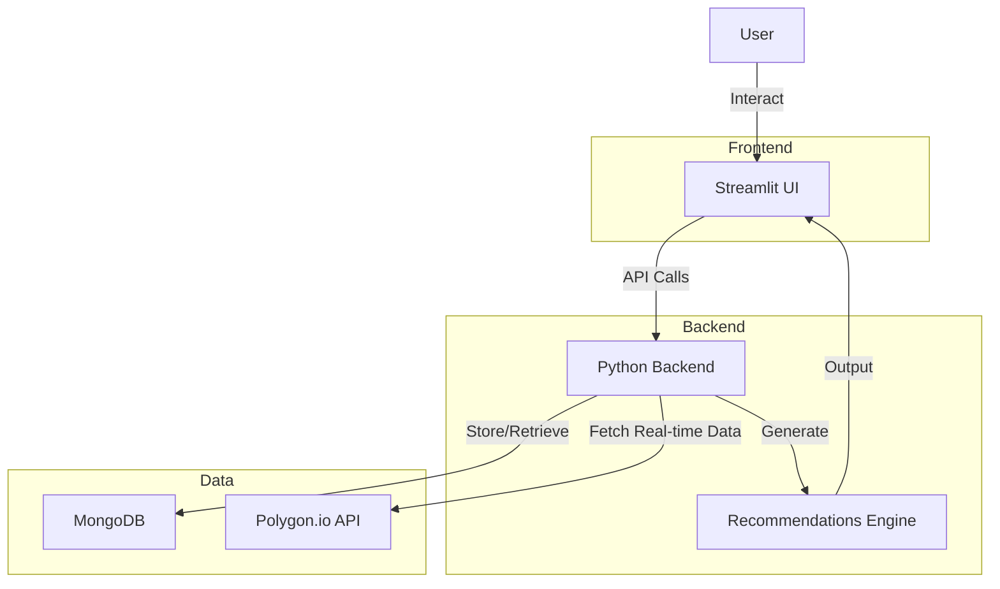

# Investment Management Application Design Document

## Overview
This application manages investment portfolios, tracking accounts, positions (stocks, options, cash), watch lists, and generating recommendations. It aggregates portfolio values, supports risk profiles and strategies per account, and integrates real-time data from Polygon.io. Built with Python backend, Streamlit UI, and MongoDB for local storage.

## Requirements

### Functional Requirements
- **Portfolio Management**: Define a portfolio that aggregates values from one or more accounts. Portfolio includes total value roll-up, performance metrics (e.g., ROI, unrealized gains/losses).
- **Account Management**: Each account has:
  - Unique ID, name, balance.
  - Risk level (e.g., low, medium, high).
  - Preferred investment strategy (e.g., growth, income, balanced; moderate/aggressive options aligned with user goals like Tesla-focused growth to 1M shares by 2030).
  - Zero or many positions.
  - Recommendations generated based on positions (e.g., buy/sell suggestions using current/mid/future earnings data for stocks like TSLA, NVDA).
- **Position Management**: Positions can be:
  - Stocks: Ticker, shares, purchase price, current value (fetched via Polygon).
  - Options: Contract details (strike, expiration, type: call/put), quantity, premium (reference PDF risks in Chapter X for warnings).
  - Cash: Amount, currency.
  - Each position links to a watch list item (optional: alerts for price thresholds).
- **Watch List**: Per position or account, track symbols with alerts (e.g., price changes, news).
- **Recommendations**: Algorithmic suggestions per account, factoring risk/strategy. Moderate: Bull call spreads on TSLA/NVDA. Aggressive: OTM calls on volatile stocks like IONQ. Tie to user goal of portfolio growth.
- **Real-time Updates**: Fetch stock/option prices via Polygon API for live UI refreshes.
- **Data Persistence**: Store portfolios, accounts, positions in MongoDB.
- **UI Features**: Streamlit dashboard with views for portfolios, accounts, positions; real-time charts; input forms for adding/editing; recommendation panel.

### Non-Functional Requirements
- **Performance**: Real-time updates via WebSockets or polling (every 5-10s during market hours).
- **Security**: Local app; basic auth for UI. API keys for Polygon stored securely.
- **Scalability**: Local use; MongoDB handles small datasets.
- **Tech Stack**: Python (FastAPI or Flask backend), Streamlit (UI), PyMongo (DB), Polygon.io SDK.
- **Deployment**: Local run; potential Docker for portability.

## High-Level Design

### Components
- **Backend**: Python service handling CRUD for portfolios/accounts/positions. Integrates Polygon for quotes. Generates recommendations using simple rules/ML (e.g., pandas for analysis).
- **Database**: MongoDB schemas:
  - Portfolio: {_id, name, accounts: [account_ids], total_value}.
  - Account: {_id, name, risk_level, strategy, positions: [position_ids], recommendations: []}.
  - Position: {_id, type (stock/option/cash), details (ticker/strike/etc.), watch_list: {symbol, alerts}}.
- **UI**: Streamlit pages: Login, Dashboard (portfolio overview), Account View (positions/recommendations), Add/Edit forms.
- **Integration**: Polygon API for real-time data (stocks, options chains). WebSocket for updates.
- **Recommendation Engine**: Rule-based: For moderate, suggest spreads on TSLA (e.g., buy $450 call, sell $500); aggressive, OTM calls. Factor PDF risks (e.g., premium loss).

### Data Flow
1. User adds portfolio/account/position via UI.
2. Backend saves to MongoDB.
3. UI requests updates; backend fetches from Polygon, computes values/recommendations.
4. Display aggregated portfolio value, positions, suggestions.

## Architecture Diagram

## Next Steps
Implement backend schemas and API endpoints first. Provide code snippets if requested for details. Reference PDF Chapter X for option risk integration in recommendations.